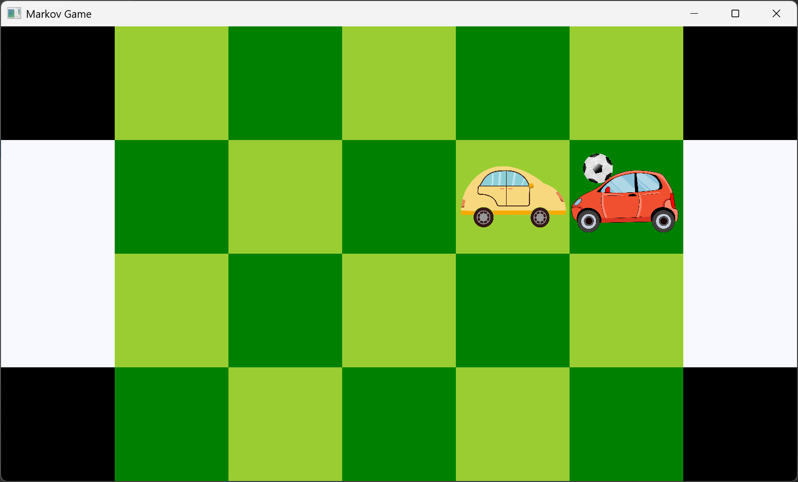

<h1>FictitiousPlay</h1>

Algorithm to solve for an exact Nash equilibrium of a zero-sum 
markov game. The <a href="https://en.wikipedia.org/wiki/Fictitious_play" target="_blank">wiki page</a> 
has some more information about convergence guarantees. Set up for 
two games, both of which have support for multiple board dimensions, multiple action spaces, and stochastic transition
functions.

<h3>Car Game</h3>

Set up for any k number of agents in a pursuit-evasion game. They can move up, down, left, right (and sometimes 
stay still depending on the action space). Agents in the pursuer class try to crash into agents, agents in the evader 
class try to avoid being crashed into.

<h3>Soccer Game</h3>

Two agents try to score in the opponent's goal (White tiles). They can move up, down, left, right, or stay still.
Uses a stochastic transition function as detailed in 
<a href="https://courses.cs.duke.edu/spring07/cps296.3/littman94markov.pdf">this paper</a> which describes how agents
can steal the ball or block a player.

